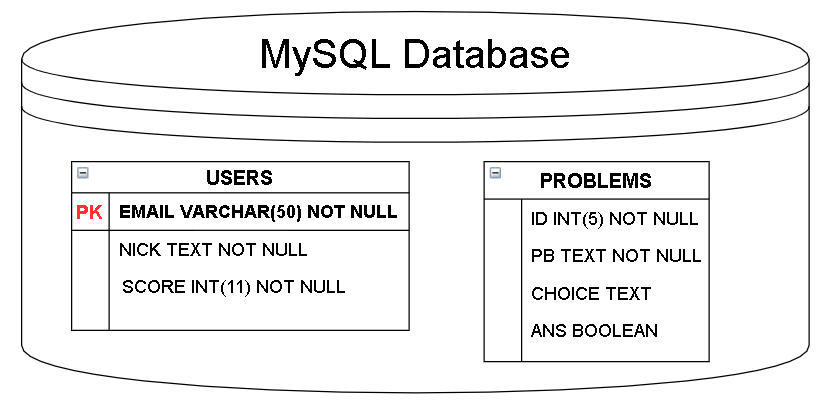
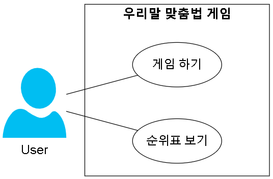
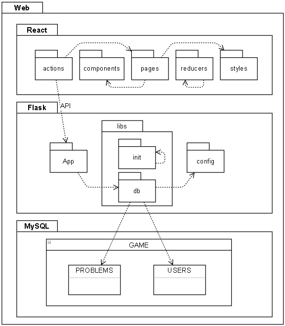
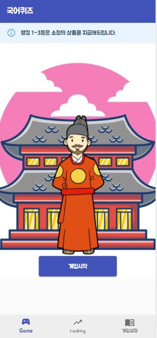
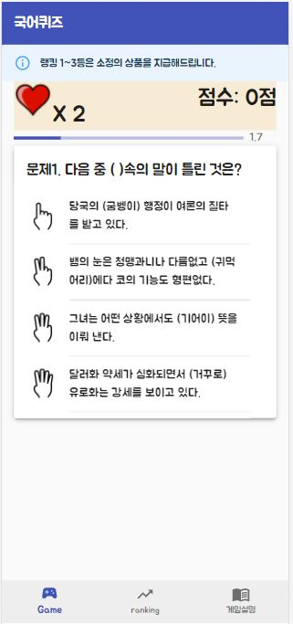
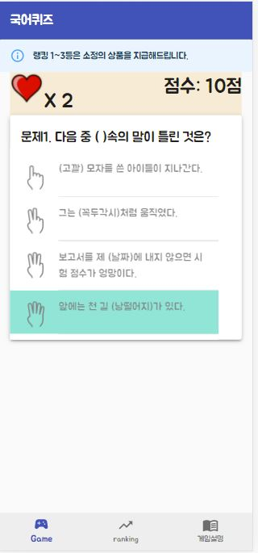
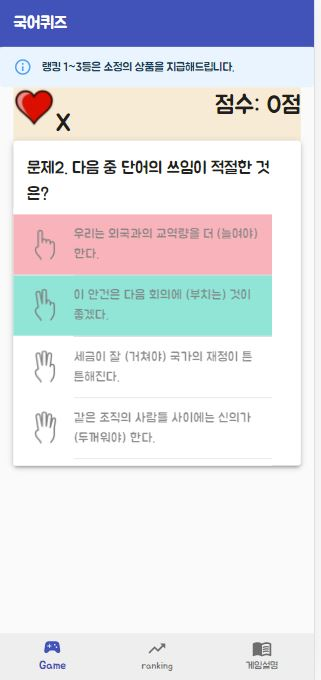
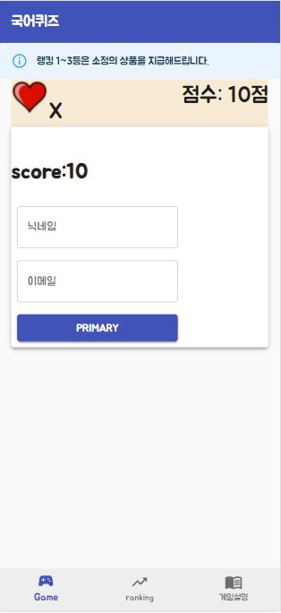
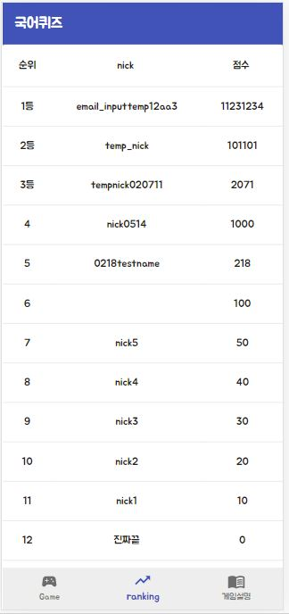

# 센터가 좋아요
## 맞춤법 게임

## 목차
<p>

[0. 팀 소개](#0-팀-소개)
</p>
<p>

[1. 개요](#1-개요)
</p>
<p>

[2. 데이터베이스 스키마](#2-데이터베이스-스키마)
</p>
<p>

[3. 구성도](#3-구성도)
</p>
<p>

[4. 백엔드 API 명세서](#4-백엔드-api-명세서)
</p>
<p>

[5. 동작 구현](#5-동작-구현)
</p>
<p>

[6. 실행 화면](#6-실행-화면)
</p>
<p>

[7. 바람](#7-바람)
</p>


# 0. 👋팀 소개


- #### 팀 이름 : 센터가 좋아요
- #### 팀장 : 정혜일
- #### 팀원 : 정혜일, 박창환, 김찬혁, 이상현, 오승진, 양성훈
- #### 역할 :

| 프론트 | 백엔드 |  
|---|---|  
| - 양성훈 </br> - 김찬혁 </br> - 오승진 | - 정혜일 </br> - 박창환 </br> - 이상현 |

</br></br>

# 1. 📝개요  

- ## **공공데이터를 활용한 맞춤법 게임**  
인터넷에는 이런 문장이 유머로 떠돕니다.
‘마마잃은 중천공’, ‘일해라 절해라 하지 마’. 누리꾼들이 올린 실화에서 따온 문장들입니다.
남아 일언 중천금이 마마잃은 중천공으로, 이래라저래라 하지 마가 일해라 절해라 하지 마로 변형된 것인데요. 틀린 맞춤법의 극단적인 예시입니다.
</br>
다들 위의 문장들을 보고 웃으셨나요? 실소라도 흘리셨나요?
그렇다면 여러분은, ‘뵈요’/‘봬요’, ‘해도 되?’/‘해도 돼?’, ‘뭐에요?’/‘뭐예요?’. 둘 중 어떤 것이 옳은지 구별할 수 있으신가요?
</br>
이러한 문제점을 해결하기 위해 맞춤법 문제 공공데이터를 활용하여 맞춤법 게임을 통해 맞춤법 실력을 증진시키고자 이 프로젝트를 진행하였습니다.
</br></br>

# 2. 📋데이터베이스 스키마

<div align="center">
  <figure>
      
      <div align="center"><figcation>MySQL DB schema</figcation></div>
  </figure>
</div>

 
</br></br>
# 3. 📈구성도
- **Usecase Diagram**

<div align="center">
  <figure>
      
      <div align="center"><figcation>UseCase Diagram</figcation></div>
  </figure>
</div>

- **Component Diagram**

<div align="center">
  <figure>
      
      <div align="center"><figcation>Package Diagram</figcation></div>
  </figure>
</div>
 
</br></br>

# 4. 백엔드 API 명세서
<p>백엔드 Flask 서버 API 명세서</p>

<p>

<span style="color:green">**GET**</span> **/getQuizList**
</p>
<p>
서울 열린데이터 광장에서 제공하는 우리말 문제 데이터를 클라이언트 측에서 요청한 개수(num)만큼 무작위로 제공한다.
</p>

<p>

```
https://flask-awesome-game-rhmph.run.goorm.io/getQuizList?num=5
```
</p>

<p>

**Request Params**
</p>
<p>
num &nbsp; &nbsp; &nbsp; &nbsp; int
</p>
<p>

**Response**
</p>
<p>

[<br>
&nbsp; &nbsp; {<br>
&nbsp; &nbsp; &nbsp; &nbsp; "PB": ""다음 ( )속의 띄어쓰기가 틀린 것은?",</br>
&nbsp; &nbsp; &nbsp; &nbsp; "CHOICES": "앞서 (지적한 바와) 같다.",</br>   &nbsp; &nbsp; &nbsp; &nbsp; &nbsp; &nbsp; &nbsp; &nbsp; &nbsp; &nbsp;&nbsp; &nbsp; &nbsp; &nbsp;
"우리는 이제 결사 항전을 (성언하는 바이다).",</br>
&nbsp; &nbsp; &nbsp; &nbsp;&nbsp; &nbsp; &nbsp; &nbsp;&nbsp; &nbsp; &nbsp; &nbsp;&nbsp; &nbsp; &nbsp; &nbsp;"(내 능력 밖의) 일이다.",</br>
&nbsp;  &nbsp;&nbsp; &nbsp;&nbsp; &nbsp; &nbsp; &nbsp;&nbsp; &nbsp; &nbsp; &nbsp;&nbsp; &nbsp; &nbsp; &nbsp;"(공부 밖에) 모르는 학생이다."<br>
&nbsp; &nbsp; &nbsp; &nbsp; "ANS": 3<br>
&nbsp; &nbsp; },<br>
&nbsp; &nbsp; ...<br>
]
</p>


<span style="color:red">**POST**</span> **/insertUser**
</p>
<p>

클라이언트 측에서 사용자의 이메일, 닉네임, 점수 데이터를 받아 데이터베이스에 삽입한다. 새로운 사용자인 경우에는 데이터베이스에 삽입하고, 기존에 있는 사용자인 경우에는 클라이언트에서 요청한 점수가 데이터베이스에 있는 점수보다 크거나 같을 때만 해당 사용자의 닉네임과 점수를 갱신한다.
</p>

<p>

```
https://flask-awesome-game-rhmph.run.goorm.io/insertUser
```
</p>

<p>

**Request Params**
</p>
<p>
email &nbsp; &nbsp; &nbsp; &nbsp; string <br>
name &nbsp; &nbsp; &nbsp; &nbsp; string <br>
score &nbsp; &nbsp; &nbsp; &nbsp; int <br>
</p>
<p>

**Response**
</p>
<p>

 - 정상적으로 데이터베이스에 삽입 된 경우<br>
  

{<br>
&nbsp; &nbsp; "status_code": 200,<br>
&nbsp; &nbsp; "result": True<br>
}<br>

 - 정상적으로 데이터베이스에 삽입되지 않은 경우

{<br>
&nbsp; &nbsp; "status_code": 400,<br>
&nbsp; &nbsp; "result": False<br>
}<br>
</p>


<span style="color:green">**GET**</span> **/getScoreList**
</p>
<p>
유저의 닉네임과 점수를 제공한다.
</p>

<p>

```
https://flask-awesome-game-rhmph.run.goorm.io/getScoreList
```
</p>
<p>

**Response**
</p>
<p>

[<br>
&nbsp; &nbsp; {<br>
&nbsp; &nbsp; &nbsp; &nbsp; "NICK": "email_inputtemp12aa3",<br>
&nbsp; &nbsp; &nbsp; &nbsp; "SCORE": 1234<br>
&nbsp; &nbsp; },<br>
&nbsp; &nbsp; ...<br>
]
</p>


# 5. 📐동작 구현
1. 웹페이지에 접속 시 게임 UI가 나타남
2. 게임시작 버튼을 누르면 getQuizList url을 통해 문제를 랜덤하게 가져옴
3. 1문제에 10초의 제한시간을 주고 시간안에 풀지 못하거나 오답을 선택할 시 라이프 1개 감소함
4. 라이프를 모두 소진했을 시 게임이 끝나고 닉네임과 이메일을 insertUser url을 통해 score와 사용자 정보를 업데이트함
5. getScoreList url을 통해 랭킹을 가져옴
</br></br>
# 6. 👀실행 화면 

<div align="center">
  <figure>
      
      <div align="center"><figcation>메인 화면</figcation></div>
  </figure>
</div>

<br>

<div align="center">
  <figure>
      
      <div align="center"><figcation>게임 화면</figcation></div>
  </figure>
</div>

<br>

<div align="center">
  <figure>
      
      <div align="center"><figcation>정답 화면</figcation></div>
  </figure>
</div>

<br>

<div align="center">
  <figure>
      
      <div align="center"><figcation>오답 화면</figcation></div>
  </figure>
</div>

<br>

<div align="center">
  <figure>
      
      <div align="center"><figcation>사용자 정보 화면</figcation></div>
  </figure>
</div>

<br>

<div align="center">
  <figure>
      
      <div align="center"><figcation>랭크 화면</figcation></div>
  </figure>
</div>

</br></br>

# 7. 🎈바람
망가졌던 우리의 언어습관과 부족했던 맞춤법 지식을 게임을 통해 향상시키면서 재미도 느꼈으면 좋겠다.
맞춤법 게임을 통해 즐겁게 맞춤법 실력을 향상시킬 수 있게 되고 사회적으로 문제였던 맞춤법 문제를 해결할 수 있다. 
</br></br>
</br></br>


